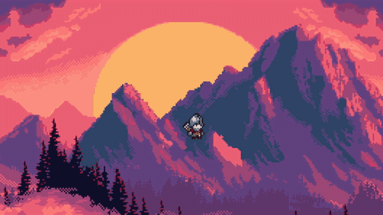

# [2D Parallax] – Week [1] Dev-Log

## Goal
Implement a simple parallax effect using Godot's built in node

## Implementation Highlights
- Utilizing `ParallaxBackground` paired with multiple `ParallaxLayer` to create the 2D parallax effect by adjusting each layer to scroll at different speeds.
- Created simple player movement using move_and_slide() to showcase the parallax effect.

## What I Learned
- How to properly use `ParallaxBackground` and `Parallax2D` together in order to make distance look realistic.
- Importing assets and getting into the workflow of making them render properly.

## Time Spent
| Task                    | Hours |
|-------------------------|------:|
| Creating boilerplate player controller | 0.5 |
| Gathering resources online | 0.5 |
| Setting up parallax layers | 0.5 |
| **Total**               | **1.5 h** |
